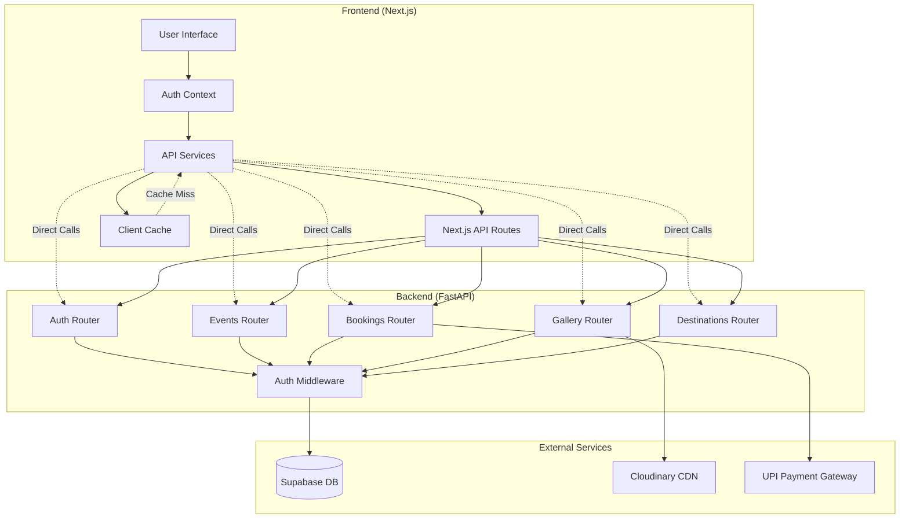

# Backend-Frontend Integration Design

## Overview

This design document outlines the comprehensive integration architecture between the SafarSaga travel platform's FastAPI backend and Next.js frontend. The system implements a modern, secure, and scalable architecture that ensures seamless communication, proper error handling, and consistent user experience across all platform features.

The integration follows a hybrid approach where the frontend can communicate directly with the FastAPI backend for optimal performance while maintaining Next.js API routes as proxies for additional processing, caching, and fallback mechanisms.

## Architecture

### System Architecture Diagram



### Communication Patterns

1. **Direct Backend Communication**: Frontend services communicate directly with FastAPI for real-time operations
2. **Proxy Pattern**: Next.js API routes act as proxies for additional processing and caching
3. **Hybrid Fallback**: System can fall back to Supabase direct access if backend is unavailable
4. **Event-Driven Updates**: Real-time updates through WebSocket connections for booking status changes

## Components and Interfaces

### Frontend Components

#### 1. Authentication Service (`lib/auth-api.ts`)
- **Purpose**: Manages all authentication operations with the FastAPI backend
- **Key Methods**:
  - `signIn(email, password)`: Authenticate user and store JWT token
  - `signUp(email, password, fullName)`: Register new user
  - `getCurrentUser(token)`: Fetch current user profile
  - `refreshToken(token)`: Refresh expired JWT tokens
  - `socialAuth(provider, credential)`: Handle social login
- **Token Management**: Secure storage and automatic refresh of JWT tokens
- **Error Handling**: Comprehensive error handling with user-friendly messages

#### 2. Booking Service (`lib/booking-service.ts`)
- **Purpose**: Manages booking operations with backend integration
- **Key Methods**:
  - `createBooking(request)`: Create new booking via backend API
  - `getUserBookings()`: Fetch user's booking history
  - `processPayment(paymentRequest)`: Handle payment processing
  - `cancelBooking(bookingId)`: Cancel existing booking
- **Data Transformation**: Converts between frontend and backend data formats
- **Caching**: Implements client-side caching for booking data

#### 3. Auth Context (`contexts/AuthContext.tsx`)
- **Purpose**: Provides global authentication state management
- **Features**:
  - JWT token lifecycle management
  - Automatic token refresh
  - User session persistence
  - Social authentication support
- **State Management**: Centralized auth state with React Context

#### 4. API Proxy Routes (`app/api/*/route.ts`)
- **Purpose**: Provide additional processing layer between frontend and backend
- **Features**:
  - Request/response transformation
  - Caching layer implementation
  - Error handling and logging
  - Rate limiting and security checks

### Backend Components

#### 1. FastAPI Main Application (`backend/app/main.py`)
- **Purpose**: Central application configuration and routing
- **Features**:
  - CORS configuration for frontend domains
  - Comprehensive API documentation
  - Global exception handling
  - Health check endpoints
- **Security**: Implements security headers and request logging

#### 2. Authentication Router (`backend/app/routers/auth.py`)
- **Purpose**: Handles all authentication operations
- **Endpoints**:
  - `POST /auth/login`: User authentication
  - `POST /auth/signup`: User registration
  - `GET /auth/me`: Get current user profile
  - `POST /auth/refresh`: Token refresh
  - `POST /auth/social`: Social authentication
- **Security**: JWT token generation and validation

#### 3. Bookings Router (`backend/app/routers/bookings.py`)
- **Purpose**: Manages booking operations and payment processing
- **Endpoints**:
  - `GET /api/bookings`: List user bookings
  - `POST /api/bookings`: Create new booking
  - `GET /api/bookings/{id}`: Get booking details
  - `POST /api/bookings/{id}/confirm-payment`: Process payment
  - `DELETE /api/bookings/{id}`: Cancel booking
- **Features**: Integration with payment gateways and booking validation

#### 4. Events Router (`backend/app/routers/events.py`)
- **Purpose**: Manages travel events and trip data
- **Endpoints**:
  - `GET /api/events`: List available trips
  - `POST /api/events`: Create new trip (admin only)
  - `GET /api/events/{id}`: Get trip details
  - `PUT /api/events/{id}`: Update trip (admin only)
- **Features**: Advanced filtering and search capabilities

## Data Models

### User Authentication Model

```typescript
interface User {
  id: string
  email: string
  full_name: string
  phone?: string
  avatar_url?: string
  provider: 'email' | 'google' | 'facebook' | 'github'
  is_admin: boolean
  is_verified: boolean
  created_at: string
  updated_at: string
}

interface LoginResponse {
  access_token: string
  token_type: string
  user: User
}
```

### Booking Data Model

```typescript
interface BookingRequest {
  destinationId: string
  seats: number
  travelDate?: string
  specialRequests?: string
  contactInfo: {
    phone: string
    emergencyContact?: string
  }
}

interface BookingResponse {
  id: string
  bookingReference: string
  destination: BookingDestination
  seats: number
  totalAmount: number
  bookingStatus: 'pending' | 'confirmed' | 'cancelled'
  paymentStatus: 'unpaid' | 'paid' | 'refunded'
  travelDate?: string
  specialRequests?: string
  contactInfo: ContactInfo
  createdAt: string
  paymentDetails?: PaymentDetails
}
```

### API Response Format

```typescript
interface APIResponse<T> {
  data?: T
  error?: string
  message?: string
  status_code: number
  timestamp: string
}

interface PaginatedResponse<T> {
  items: T[]
  total: number
  page: number
  limit: number
  has_next: boolean
  has_prev: boolean
}
```

## Error Handling

### Error Classification

1. **Authentication Errors** (401, 403)
   - Invalid credentials
   - Expired tokens
   - Insufficient permissions
   - Account verification required

2. **Validation Errors** (400, 422)
   - Invalid input data
   - Missing required fields
   - Business rule violations
   - Constraint violations

3. **Resource Errors** (404, 409)
   - Resource not found
   - Resource conflicts
   - Capacity limitations
   - Booking conflicts

4. **System Errors** (500, 502, 503)
   - Internal server errors
   - Database connectivity issues
   - External service failures
   - Network timeouts

### Error Handling Strategy

#### Frontend Error Handling

```typescript
class APIErrorHandler {
  static async handleResponse(response: Response) {
    if (!response.ok) {
      const errorData = await response.json().catch(() => ({}))
      
      switch (response.status) {
        case 401:
          // Handle authentication errors
          await this.handleAuthError(errorData)
          break
        case 403:
          // Handle authorization errors
          this.handleAuthorizationError(errorData)
          break
        case 422:
          // Handle validation errors
          this.handleValidationError(errorData)
          break
        case 500:
          // Handle server errors
          this.handleServerError(errorData)
          break
        default:
          this.handleGenericError(errorData)
      }
    }
    return response
  }
}
```

#### Backend Error Handling

```python
class SafarSagaException(Exception):
    def __init__(self, message: str, status_code: int = 500, error_type: str = None):
        self.message = message
        self.status_code = status_code
        self.error_type = error_type or self.__class__.__name__

@app.exception_handler(SafarSagaException)
async def safarsaga_exception_handler(request: Request, exc: SafarSagaException):
    return JSONResponse(
        status_code=exc.status_code,
        content={
            "error": exc.message,
            "error_type": exc.error_type,
            "timestamp": datetime.utcnow().isoformat(),
            "path": request.url.path
        }
    )
```

## Testing Strategy

### Frontend Testing

1. **Unit Tests**
   - API service methods
   - Authentication context
   - Data transformation utilities
   - Error handling functions

2. **Integration Tests**
   - Authentication flow end-to-end
   - Booking creation and management
   - Payment processing
   - Admin functionality

3. **Component Tests**
   - Auth-protected components
   - Booking forms and modals
   - Error boundary components
   - Loading states

### Backend Testing

1. **Unit Tests**
   - Authentication middleware
   - Booking validation logic
   - Payment processing
   - Data model operations

2. **API Tests**
   - Endpoint functionality
   - Authentication requirements
   - Input validation
   - Error responses

3. **Integration Tests**
   - Database operations
   - External service integration
   - End-to-end booking flow
   - Admin operations

### End-to-End Testing

1. **User Journey Tests**
   - Complete booking flow
   - Authentication and authorization
   - Payment processing
   - Admin management tasks

2. **Performance Tests**
   - API response times
   - Concurrent user handling
   - Database query optimization
   - Image loading performance

## Security Considerations

### Authentication Security

1. **JWT Token Management**
   - Secure token storage in httpOnly cookies or localStorage
   - Automatic token refresh before expiration
   - Token revocation on logout
   - Protection against XSS and CSRF attacks

2. **Password Security**
   - Strong password requirements
   - Secure password hashing (bcrypt)
   - Password reset functionality
   - Account lockout protection

### API Security

1. **Request Validation**
   - Input sanitization and validation
   - Rate limiting per user/IP
   - Request size limitations
   - SQL injection prevention

2. **Authorization**
   - Role-based access control
   - Resource-level permissions
   - Admin privilege verification
   - API endpoint protection

### Data Protection

1. **Sensitive Data Handling**
   - PII encryption at rest
   - Secure data transmission (HTTPS)
   - Payment data compliance (PCI DSS)
   - Audit logging for sensitive operations

2. **Privacy Compliance**
   - GDPR compliance measures
   - Data retention policies
   - User consent management
   - Right to data deletion

## Performance Optimization

### Caching Strategy

1. **Client-Side Caching**
   - React Query for API response caching
   - Browser localStorage for user preferences
   - Service worker for offline functionality
   - Image caching through Cloudinary

2. **Server-Side Caching**
   - Redis for session storage
   - Database query result caching
   - API response caching
   - Static asset caching

### Database Optimization

1. **Query Optimization**
   - Proper indexing strategy
   - Query result pagination
   - Lazy loading for related data
   - Connection pooling

2. **Data Structure Optimization**
   - Normalized database schema
   - Efficient foreign key relationships
   - Optimized data types
   - Regular performance monitoring

### API Performance

1. **Response Optimization**
   - Gzip compression
   - Minimal response payloads
   - Parallel request processing
   - Connection keep-alive

2. **Resource Management**
   - Efficient memory usage
   - CPU optimization
   - Network bandwidth optimization
   - Scalable architecture design