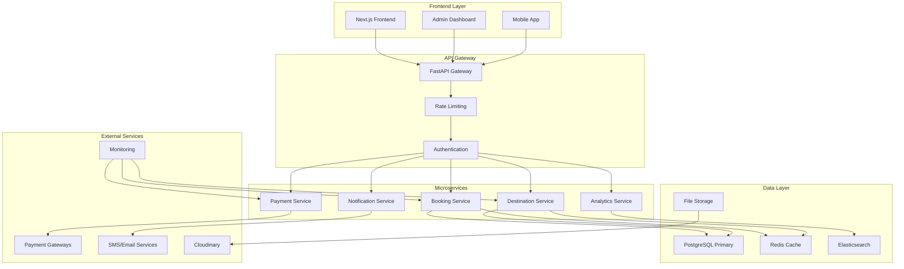

# Enterprise Booking System Design

## Overview

This document outlines the design for a comprehensive, enterprise-level booking system that will handle real-time bookings, destination management, inventory control, and provide complete CRUD functionality. The system is designed to be scalable, secure, and performant while maintaining data integrity and providing excellent user experience.

## Architecture

### System Architecture Overview



### Technology Stack

**Backend:**
- **FastAPI**: High-performance Python web framework
- **PostgreSQL**: Primary database with ACID compliance
- **Redis**: Caching and session management
- **Elasticsearch**: Search and analytics
- **Celery**: Asynchronous task processing
- **WebSockets**: Real-time updates

**Frontend:**
- **Next.js 14**: React framework with SSR/SSG
- **TypeScript**: Type safety and better development experience
- **Tailwind CSS**: Utility-first CSS framework
- **React Query**: Data fetching and caching
- **Zustand**: State management

**Infrastructure:**
- **Docker**: Containerization
- **Kubernetes**: Orchestration and scaling
- **NGINX**: Load balancing and reverse proxy
- **Prometheus/Grafana**: Monitoring and alerting
- **Sentry**: Error tracking and performance monitoring

## Components and Interfaces

### 1. Destination Management Service

#### Core Components

**DestinationManager**
```python
class DestinationManager:
    async def create_destination(self, destination_data: DestinationCreate) -> Destination
    async def update_destination(self, destination_id: str, updates: DestinationUpdate) -> Destination
    async def get_destination(self, destination_id: str) -> Optional[Destination]
    async def list_destinations(self, filters: DestinationFilters) -> PaginatedResponse[Destination]
    async def delete_destination(self, destination_id: str) -> bool
    async def update_availability(self, destination_id: str, availability: AvailabilityUpdate) -> bool
```

**InventoryManager**
```python
class InventoryManager:
    async def check_availability(self, destination_id: str, date: datetime, seats: int) -> bool
    async def reserve_seats(self, destination_id: str, date: datetime, seats: int, ttl: int = 900) -> str
    async def confirm_reservation(self, reservation_id: str) -> bool
    async def release_reservation(self, reservation_id: str) -> bool
    async def get_availability_calendar(self, destination_id: str, start_date: datetime, end_date: datetime) -> Dict
```

#### Data Models

```python
class Destination(BaseModel):
    id: str
    name: str
    location: str
    description: str
    category: DestinationCategory
    difficulty_level: DifficultyLevel
    base_price: Decimal
    seasonal_pricing: Dict[str, Decimal]
    max_capacity: int
    min_group_size: int
    max_group_size: int
    duration_days: int
    duration_nights: int
    inclusions: List[str]
    exclusions: List[str]
    itinerary: List[ItineraryDay]
    images: List[DestinationImage]
    amenities: List[str]
    policies: DestinationPolicies
    availability_calendar: Dict[str, AvailabilitySlot]
    is_active: bool
    created_at: datetime
    updated_at: datetime
    created_by: str

class AvailabilitySlot(BaseModel):
    date: datetime
    available_seats: int
    reserved_seats: int
    confirmed_bookings: int
    price_multiplier: float
    is_available: bool
    special_notes: Optional[str]
```

### 2. Booking Management Service

#### Core Components

**BookingEngine**
```python
class BookingEngine:
    async def create_booking(self, booking_request: BookingRequest) -> BookingResponse
    async def update_booking(self, booking_id: str, updates: BookingUpdate) -> BookingResponse
    async def cancel_booking(self, booking_id: str, reason: str) -> CancellationResponse
    async def get_booking(self, booking_id: str) -> Optional[BookingResponse]
    async def list_user_bookings(self, user_id: str, filters: BookingFilters) -> PaginatedResponse[BookingResponse]
    async def process_payment(self, booking_id: str, payment_data: PaymentRequest) -> PaymentResponse
```

**ReservationManager**
```python
class ReservationManager:
    async def create_temporary_reservation(self, booking_data: BookingRequest) -> TemporaryReservation
    async def extend_reservation(self, reservation_id: str, additional_minutes: int) -> bool
    async def convert_to_booking(self, reservation_id: str, payment_data: PaymentRequest) -> BookingResponse
    async def cleanup_expired_reservations(self) -> int
```

#### Data Models

```python
class BookingRequest(BaseModel):
    destination_id: str
    user_id: str
    travel_date: datetime
    seats: int
    traveler_details: List[TravelerInfo]
    special_requests: Optional[str]
    contact_info: ContactInfo
    emergency_contact: EmergencyContact
    dietary_requirements: Optional[List[str]]
    accessibility_needs: Optional[List[str]]

class BookingResponse(BaseModel):
    id: str
    booking_reference: str
    user_id: str
    destination: DestinationSummary
    travel_date: datetime
    seats: int
    total_amount: Decimal
    booking_status: BookingStatus
    payment_status: PaymentStatus
    traveler_details: List[TravelerInfo]
    contact_info: ContactInfo
    special_requests: Optional[str]
    booking_timeline: List[BookingEvent]
    cancellation_policy: CancellationPolicy
    created_at: datetime
    updated_at: datetime

class TemporaryReservation(BaseModel):
    id: str
    destination_id: str
    user_id: str
    travel_date: datetime
    seats: int
    expires_at: datetime
    total_amount: Decimal
    status: ReservationStatus
```

### 3. Payment Processing Service

#### Core Components

**PaymentProcessor**
```python
class PaymentProcessor:
    async def process_payment(self, payment_request: PaymentRequest) -> PaymentResponse
    async def verify_payment(self, transaction_id: str, gateway: PaymentGateway) -> PaymentVerification
    async def initiate_refund(self, booking_id: str, amount: Decimal, reason: str) -> RefundResponse
    async def get_payment_methods(self, user_id: str, amount: Decimal) -> List[PaymentMethod]
    async def generate_payment_link(self, booking_id: str) -> PaymentLink
```

**RefundManager**
```python
class RefundManager:
    async def calculate_refund_amount(self, booking_id: str, cancellation_date: datetime) -> RefundCalculation
    async def process_refund(self, booking_id: str, refund_amount: Decimal) -> RefundResponse
    async def track_refund_status(self, refund_id: str) -> RefundStatus
```

#### Payment Gateway Integration

```python
class PaymentGatewayManager:
    def __init__(self):
        self.gateways = {
            'razorpay': RazorpayGateway(),
            'payu': PayUGateway(),
            'stripe': StripeGateway(),
            'upi': UPIGateway()
        }
    
    async def route_payment(self, payment_request: PaymentRequest) -> PaymentGateway
    async def process_webhook(self, gateway: str, payload: dict) -> WebhookResponse
```

### 4. Real-Time Notification Service

#### Core Components

**NotificationEngine**
```python
class NotificationEngine:
    async def send_booking_confirmation(self, booking_id: str) -> bool
    async def send_payment_reminder(self, booking_id: str) -> bool
    async def send_travel_reminder(self, booking_id: str, days_before: int) -> bool
    async def send_cancellation_notice(self, booking_id: str, reason: str) -> bool
    async def broadcast_emergency_alert(self, destination_id: str, message: str) -> int
```

**WebSocketManager**
```python
class WebSocketManager:
    async def connect_user(self, user_id: str, websocket: WebSocket) -> bool
    async def disconnect_user(self, user_id: str) -> bool
    async def send_real_time_update(self, user_id: str, update: RealtimeUpdate) -> bool
    async def broadcast_availability_update(self, destination_id: str, availability: AvailabilityUpdate) -> int
```

### 5. Analytics and Reporting Service

#### Core Components

**AnalyticsEngine**
```python
class AnalyticsEngine:
    async def track_booking_event(self, event: BookingEvent) -> bool
    async def generate_revenue_report(self, start_date: datetime, end_date: datetime) -> RevenueReport
    async def get_popular_destinations(self, period: TimePeriod) -> List[DestinationStats]
    async def calculate_conversion_rates(self, filters: AnalyticsFilters) -> ConversionMetrics
    async def predict_demand(self, destination_id: str, future_months: int) -> DemandForecast
```

**ReportGenerator**
```python
class ReportGenerator:
    async def generate_booking_summary(self, filters: ReportFilters) -> BookingSummaryReport
    async def generate_financial_report(self, period: TimePeriod) -> FinancialReport
    async def generate_customer_insights(self, segment: CustomerSegment) -> CustomerInsightsReport
    async def export_data(self, report_type: ReportType, format: ExportFormat) -> ExportResult
```

## Data Models

### Enhanced Database Schema

```sql
-- Destinations table with comprehensive fields
CREATE TABLE destinations (
    id UUID PRIMARY KEY DEFAULT uuid_generate_v4(),
    name VARCHAR(255) NOT NULL,
    slug VARCHAR(255) UNIQUE NOT NULL,
    location JSONB NOT NULL, -- {country, state, city, coordinates}
    description TEXT,
    short_description VARCHAR(500),
    category destination_category NOT NULL,
    difficulty_level difficulty_level,
    base_price DECIMAL(10,2) NOT NULL,
    seasonal_pricing JSONB, -- {season: price_multiplier}
    max_capacity INTEGER NOT NULL,
    min_group_size INTEGER DEFAULT 1,
    max_group_size INTEGER,
    duration_days INTEGER NOT NULL,
    duration_nights INTEGER NOT NULL,
    inclusions TEXT[],
    exclusions TEXT[],
    itinerary JSONB, -- Detailed day-by-day itinerary
    images JSONB, -- Array of image objects with metadata
    amenities TEXT[],
    policies JSONB, -- Cancellation, refund, and other policies
    tags TEXT[],
    seo_metadata JSONB,
    is_active BOOLEAN DEFAULT true,
    is_featured BOOLEAN DEFAULT false,
    sort_order INTEGER DEFAULT 0,
    created_at TIMESTAMP WITH TIME ZONE DEFAULT NOW(),
    updated_at TIMESTAMP WITH TIME ZONE DEFAULT NOW(),
    created_by UUID REFERENCES users(id)
);

-- Availability calendar for real-time inventory management
CREATE TABLE destination_availability (
    id UUID PRIMARY KEY DEFAULT uuid_generate_v4(),
    destination_id UUID REFERENCES destinations(id) ON DELETE CASCADE,
    date DATE NOT NULL,
    available_seats INTEGER NOT NULL,
    reserved_seats INTEGER DEFAULT 0,
    confirmed_bookings INTEGER DEFAULT 0,
    price_multiplier DECIMAL(3,2) DEFAULT 1.00,
    is_available BOOLEAN DEFAULT true,
    special_notes TEXT,
    created_at TIMESTAMP WITH TIME ZONE DEFAULT NOW(),
    updated_at TIMESTAMP WITH TIME ZONE DEFAULT NOW(),
    UNIQUE(destination_id, date)
);

-- Enhanced bookings table
CREATE TABLE bookings (
    id UUID PRIMARY KEY DEFAULT uuid_generate_v4(),
    booking_reference VARCHAR(20) UNIQUE NOT NULL,
    user_id UUID REFERENCES users(id) ON DELETE CASCADE,
    destination_id UUID REFERENCES destinations(id),
    travel_date DATE NOT NULL,
    seats INTEGER NOT NULL CHECK (seats > 0),
    total_amount DECIMAL(10,2) NOT NULL,
    booking_status booking_status DEFAULT 'pending',
    payment_status payment_status DEFAULT 'unpaid',
    traveler_details JSONB NOT NULL, -- Array of traveler information
    contact_info JSONB NOT NULL,
    emergency_contact JSONB,
    special_requests TEXT,
    dietary_requirements TEXT[],
    accessibility_needs TEXT[],
    booking_source VARCHAR(50) DEFAULT 'web',
    referral_code VARCHAR(20),
    discount_applied DECIMAL(10,2) DEFAULT 0,
    taxes_applied DECIMAL(10,2) DEFAULT 0,
    created_at TIMESTAMP WITH TIME ZONE DEFAULT NOW(),
    updated_at TIMESTAMP WITH TIME ZONE DEFAULT NOW(),
    expires_at TIMESTAMP WITH TIME ZONE, -- For temporary reservations
    confirmed_at TIMESTAMP WITH TIME ZONE,
    cancelled_at TIMESTAMP WITH TIME ZONE,
    cancellation_reason TEXT
);

-- Payment transactions
CREATE TABLE payment_transactions (
    id UUID PRIMARY KEY DEFAULT uuid_generate_v4(),
    booking_id UUID REFERENCES bookings(id) ON DELETE CASCADE,
    transaction_id VARCHAR(100) UNIQUE NOT NULL,
    gateway VARCHAR(50) NOT NULL,
    amount DECIMAL(10,2) NOT NULL,
    currency VARCHAR(3) DEFAULT 'INR',
    status payment_transaction_status DEFAULT 'pending',
    payment_method VARCHAR(50),
    gateway_response JSONB,
    processed_at TIMESTAMP WITH TIME ZONE,
    created_at TIMESTAMP WITH TIME ZONE DEFAULT NOW()
);

-- Booking events for audit trail
CREATE TABLE booking_events (
    id UUID PRIMARY KEY DEFAULT uuid_generate_v4(),
    booking_id UUID REFERENCES bookings(id) ON DELETE CASCADE,
    event_type VARCHAR(50) NOT NULL,
    event_data JSONB,
    user_id UUID REFERENCES users(id),
    ip_address INET,
    user_agent TEXT,
    created_at TIMESTAMP WITH TIME ZONE DEFAULT NOW()
);

-- Temporary reservations for inventory locking
CREATE TABLE temporary_reservations (
    id UUID PRIMARY KEY DEFAULT uuid_generate_v4(),
    destination_id UUID REFERENCES destinations(id) ON DELETE CASCADE,
    user_id UUID REFERENCES users(id) ON DELETE CASCADE,
    travel_date DATE NOT NULL,
    seats INTEGER NOT NULL,
    expires_at TIMESTAMP WITH TIME ZONE NOT NULL,
    status reservation_status DEFAULT 'active',
    created_at TIMESTAMP WITH TIME ZONE DEFAULT NOW()
);
```

### Enums and Types

```sql
CREATE TYPE destination_category AS ENUM (
    'adventure', 'beach', 'cultural', 'nature', 'spiritual', 
    'wildlife', 'heritage', 'luxury', 'budget', 'family'
);

CREATE TYPE difficulty_level AS ENUM ('easy', 'moderate', 'challenging', 'extreme');

CREATE TYPE booking_status AS ENUM (
    'pending', 'confirmed', 'cancelled', 'completed', 'no_show'
);

CREATE TYPE payment_status AS ENUM (
    'unpaid', 'paid', 'partially_paid', 'refunded', 'partially_refunded', 'failed'
);

CREATE TYPE payment_transaction_status AS ENUM (
    'pending', 'processing', 'completed', 'failed', 'cancelled', 'refunded'
);

CREATE TYPE reservation_status AS ENUM ('active', 'expired', 'converted', 'cancelled');
```

## Error Handling

### Exception Hierarchy

```python
class BookingSystemException(Exception):
    """Base exception for booking system"""
    def __init__(self, message: str, error_code: str, details: dict = None):
        self.message = message
        self.error_code = error_code
        self.details = details or {}
        super().__init__(self.message)

class ValidationException(BookingSystemException):
    """Raised when input validation fails"""
    pass

class BusinessLogicException(BookingSystemException):
    """Raised when business rules are violated"""
    pass

class InventoryException(BookingSystemException):
    """Raised when inventory operations fail"""
    pass

class PaymentException(BookingSystemException):
    """Raised when payment processing fails"""
    pass

class ExternalServiceException(BookingSystemException):
    """Raised when external service calls fail"""
    pass
```

### Error Response Format

```python
class ErrorResponse(BaseModel):
    error: str
    error_code: str
    message: str
    details: Optional[Dict[str, Any]] = None
    timestamp: datetime
    request_id: str
    
    @classmethod
    def from_exception(cls, exc: BookingSystemException, request_id: str) -> 'ErrorResponse':
        return cls(
            error=exc.__class__.__name__,
            error_code=exc.error_code,
            message=exc.message,
            details=exc.details,
            timestamp=datetime.utcnow(),
            request_id=request_id
        )
```

## Testing Strategy

### Unit Testing

```python
# Example test structure
class TestBookingEngine:
    async def test_create_booking_success(self):
        # Test successful booking creation
        pass
    
    async def test_create_booking_insufficient_capacity(self):
        # Test booking failure due to capacity
        pass
    
    async def test_create_booking_invalid_date(self):
        # Test booking failure due to invalid travel date
        pass

class TestInventoryManager:
    async def test_reserve_seats_success(self):
        # Test successful seat reservation
        pass
    
    async def test_reserve_seats_insufficient_availability(self):
        # Test reservation failure due to insufficient seats
        pass
    
    async def test_reservation_expiry(self):
        # Test automatic reservation expiry
        pass
```

### Integration Testing

```python
class TestBookingFlow:
    async def test_complete_booking_flow(self):
        # Test end-to-end booking process
        # 1. Check availability
        # 2. Create reservation
        # 3. Process payment
        # 4. Confirm booking
        # 5. Send notifications
        pass
    
    async def test_concurrent_booking_handling(self):
        # Test race condition handling
        pass
    
    async def test_payment_failure_recovery(self):
        # Test booking recovery after payment failure
        pass
```

### Load Testing

```python
# Performance test scenarios
class LoadTestScenarios:
    async def test_concurrent_bookings(self):
        # Simulate 1000 concurrent booking attempts
        pass
    
    async def test_availability_checks(self):
        # Simulate high-frequency availability checks
        pass
    
    async def test_search_performance(self):
        # Test destination search under load
        pass
```

## Security Considerations

### Authentication and Authorization

```python
class SecurityManager:
    async def authenticate_user(self, token: str) -> Optional[User]:
        # JWT token validation
        pass
    
    async def authorize_action(self, user: User, action: str, resource: str) -> bool:
        # Role-based access control
        pass
    
    async def audit_action(self, user: User, action: str, resource: str, details: dict):
        # Security audit logging
        pass
```

### Data Protection

- **Encryption at Rest**: All sensitive data encrypted using AES-256
- **Encryption in Transit**: TLS 1.3 for all communications
- **PII Protection**: Personal information encrypted and access logged
- **Payment Security**: PCI DSS compliance for payment data
- **Data Retention**: Automated data purging based on retention policies

### Rate Limiting

```python
class RateLimiter:
    async def check_rate_limit(self, user_id: str, endpoint: str) -> bool:
        # Redis-based rate limiting
        pass
    
    async def apply_rate_limit(self, user_id: str, endpoint: str, limit: int, window: int):
        # Apply rate limiting rules
        pass
```

## Performance Optimization

### Caching Strategy

```python
class CacheManager:
    async def get_destination_cache(self, destination_id: str) -> Optional[Destination]:
        # Redis cache for destination data
        pass
    
    async def cache_availability(self, destination_id: str, date: datetime, availability: dict):
        # Cache availability data with TTL
        pass
    
    async def invalidate_cache(self, cache_key: str):
        # Cache invalidation
        pass
```

### Database Optimization

- **Indexing Strategy**: Optimized indexes for common queries
- **Query Optimization**: Prepared statements and query analysis
- **Connection Pooling**: Efficient database connection management
- **Read Replicas**: Separate read/write operations for scalability

### API Optimization

- **Response Compression**: Gzip compression for API responses
- **Pagination**: Efficient pagination for large datasets
- **Field Selection**: Allow clients to specify required fields
- **Batch Operations**: Support for bulk operations

## Monitoring and Observability

### Metrics Collection

```python
class MetricsCollector:
    def track_booking_created(self, booking_id: str, destination_id: str):
        # Track booking creation metrics
        pass
    
    def track_payment_processed(self, amount: Decimal, gateway: str, duration: float):
        # Track payment processing metrics
        pass
    
    def track_api_request(self, endpoint: str, method: str, status_code: int, duration: float):
        # Track API performance metrics
        pass
```

### Health Checks

```python
class HealthChecker:
    async def check_database_health(self) -> HealthStatus:
        # Database connectivity and performance check
        pass
    
    async def check_redis_health(self) -> HealthStatus:
        # Redis connectivity check
        pass
    
    async def check_external_services_health(self) -> Dict[str, HealthStatus]:
        # Check payment gateways, notification services, etc.
        pass
```

### Alerting

- **Error Rate Alerts**: Alert when error rates exceed thresholds
- **Performance Alerts**: Alert on slow response times
- **Capacity Alerts**: Alert when system resources are constrained
- **Business Alerts**: Alert on booking anomalies or revenue drops

## Deployment Strategy

### Containerization

```dockerfile
# Example Dockerfile for booking service
FROM python:3.11-slim

WORKDIR /app

COPY requirements.txt .
RUN pip install --no-cache-dir -r requirements.txt

COPY . .

EXPOSE 8000

CMD ["uvicorn", "main:app", "--host", "0.0.0.0", "--port", "8000"]
```

### Kubernetes Configuration

```yaml
# Example Kubernetes deployment
apiVersion: apps/v1
kind: Deployment
metadata:
  name: booking-service
spec:
  replicas: 3
  selector:
    matchLabels:
      app: booking-service
  template:
    metadata:
      labels:
        app: booking-service
    spec:
      containers:
      - name: booking-service
        image: booking-service:latest
        ports:
        - containerPort: 8000
        env:
        - name: DATABASE_URL
          valueFrom:
            secretKeyRef:
              name: db-secret
              key: url
        resources:
          requests:
            memory: "256Mi"
            cpu: "250m"
          limits:
            memory: "512Mi"
            cpu: "500m"
```

### CI/CD Pipeline

```yaml
# Example GitHub Actions workflow
name: Deploy Booking System

on:
  push:
    branches: [main]

jobs:
  test:
    runs-on: ubuntu-latest
    steps:
    - uses: actions/checkout@v2
    - name: Run tests
      run: |
        python -m pytest tests/
        
  build:
    needs: test
    runs-on: ubuntu-latest
    steps:
    - uses: actions/checkout@v2
    - name: Build and push Docker image
      run: |
        docker build -t booking-service:${{ github.sha }} .
        docker push booking-service:${{ github.sha }}
        
  deploy:
    needs: build
    runs-on: ubuntu-latest
    steps:
    - name: Deploy to Kubernetes
      run: |
        kubectl set image deployment/booking-service booking-service=booking-service:${{ github.sha }}
```

This comprehensive design provides the foundation for building an enterprise-level booking system that can handle real-time operations, maintain data integrity, and scale to meet growing demands while ensuring security and performance.